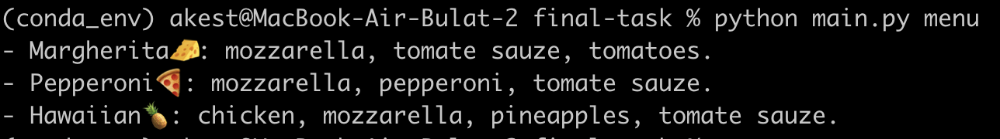
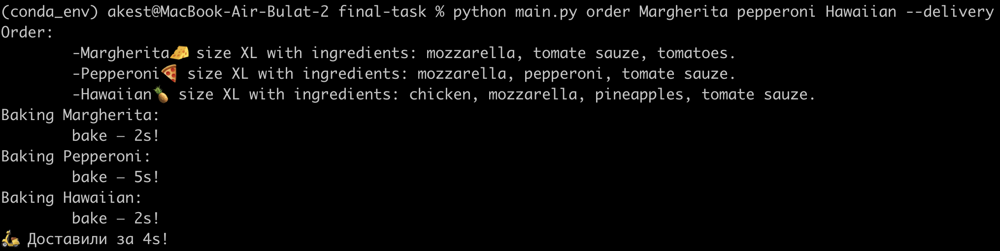
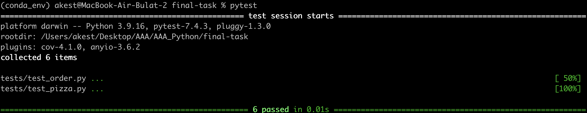

## final-task

Посмотреть доступные команды: `python main.py --help`

Для просмотра меню: `python main.py menu`

Для оформления заказа `python main.py [--delivery] Pizza1 Pizza2 ...`, например:

`python main.py order Margherita pepperoni Hawaiian --delivery`

Для запуска тестов `pytest`

mypy и flake8 не ругаются, везде есть док-стринги.